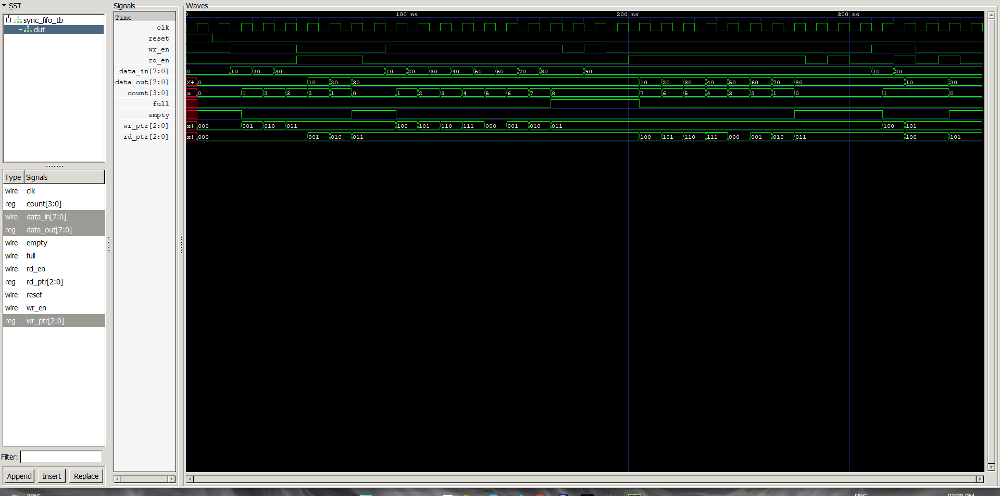

# Parameterized Synchronous FIFO Using Verilog HDL

## Project Overview

Designed and functionally verified a parameterized synchronous First-In, First-Out (FIFO) buffer using Verilog HDL.

The FIFO temporarily stores digital data and retrieves it in the same order in which it was written. The design uses a single clock for both read and write operations.

## Design Specifications

| Parameter | Specification |
|---|---|
| Design Language | Verilog HDL |
| Data Width | 8 bits (configurable) |
| FIFO Depth | 8 entries (configurable) |
| Clock | Single synchronous clock |
| Reset | Synchronous active-high |
| Simulator | Icarus Verilog |
| Waveform Viewer | GTKWave |

## Key Features

- Parameterized data width and FIFO depth
- Circular read and write pointers
- Occupancy counter to track stored data
- Full and empty status flags
- Overflow protection when FIFO is full
- Underflow protection when FIFO is empty
- Simultaneous read and write operations

## RTL Architecture

The FIFO consists of the following functional blocks:

1. **Memory Array:** Stores incoming digital data.
2. **Write Pointer:** Identifies the next memory location for writing.
3. **Read Pointer:** Identifies the next memory location for reading.
4. **Occupancy Counter:** Tracks the number of valid entries.
5. **Control Logic:** Manages read/write operations and generates full/empty flags.

All accepted read and write operations occur on the rising edge of the clock.

## Functional Verification Results

| Test Case | Result |
|---|---|
| Write and read data in FIFO order | PASS |
| FIFO full condition detection | PASS |
| Overflow write protection | PASS |
| FIFO empty condition detection | PASS |
| Underflow read protection | PASS |
| Simultaneous read and write | PASS |
| Remaining data verification | PASS |

The default 8-bit, 8-entry FIFO configuration was simulated using Icarus Verilog, and the resulting signals were inspected using GTKWave.

## Simulation Commands

Run the following commands from the project root directory:

```bash
iverilog -g2012 -s sync_fifo_tb -o fifo_sim src/sync_fifo.v tb/sync_fifo_tb.v

vvp fifo_sim

gtkwave waveform/fifo_wave.vcd
```

## Simulation Waveform



The waveform illustrates FIFO write/read operations, pointer progression, occupancy changes, and full/empty status transitions.

## Project Structure

```text
Parameterized-Synchronous-FIFO-Verilog/
├── src/
│   └── sync_fifo.v
├── tb/
│   └── sync_fifo_tb.v
├── waveform/
│   ├── fifo_wave.vcd
│   └── fifo_wave.gtkw
├── screenshots/
│   └── fifo_complete_waveform.png
└── README.md
```

## Tools and Technologies

- Verilog HDL
- Icarus Verilog
- GTKWave
- Visual Studio Code
- GitHub

## Learning Outcomes

This project provided practical experience in synchronous RTL design, memory organization, circular pointer logic, occupancy tracking, Verilog testbench development, functional simulation, and waveform analysis.

**Design Note:** The default configuration uses a power-of-two FIFO depth. The verification results documented here apply to the 8-bit, 8-entry configuration.
